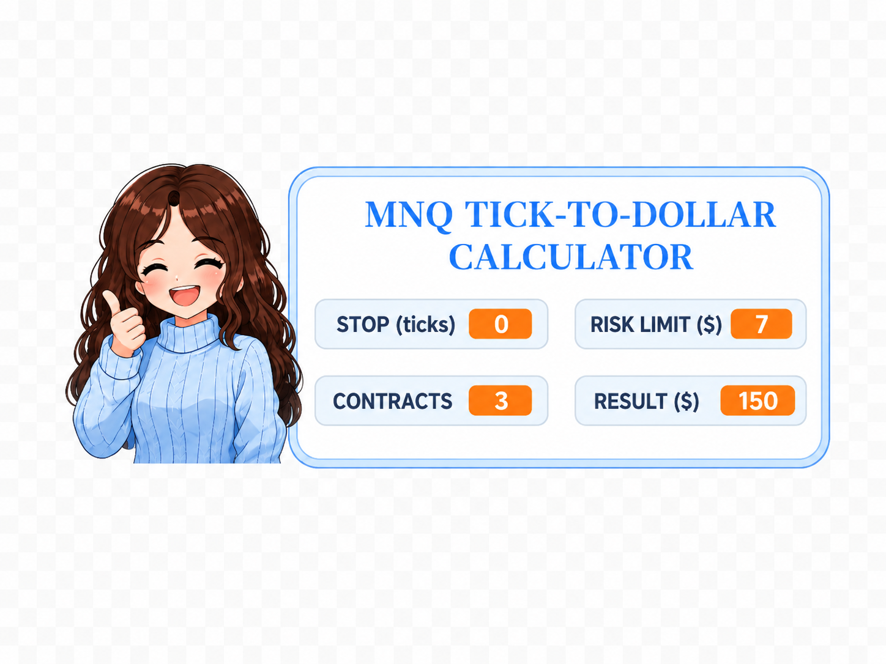

# MNQ Tick-to-Dollar Risk Calculator



A simple Scratch project that converts MNQ stop size in ticks into estimated dollar risk.

This project was created while learning programming fundamentals in CS50x. I customized it around trading because my goal is to become a Trading Software Developer.

## How it works

The user enters:

* Stop size in MNQ ticks
* Maximum risk limit in dollars
* Number of contracts

The calculator estimates the dollar risk using the MNQ tick value:

```text
Risk = stop ticks × $0.50 × contracts
```

Then it compares the estimated dollar risk with the user's maximum risk limit.

If the calculated risk is within the limit, the character shows a positive result. If the calculated risk is higher than the limit, the character warns the user that the trade is too risky.

## Example

```text
Stop ticks: 100
Risk limit: $350
Contracts: 3

Estimated risk: $150
Result: Risk OK
```

## What I practiced

* Variables
* Conditions
* Loops
* Custom blocks with input
* Basic user interaction
* Simple trading risk logic
* Visual interface design in Scratch

## Built with

* Scratch

## Project file

The Scratch project file is included in this repository:

```text
MNQ TICK RISK CALCULATOR.sb3
```

## Project context

This is my first programming project while studying CS50x. I built it around MNQ trading risk because I am learning programming with the goal of becoming a Trading Software Developer focused on trading tools, backtesting, and risk management.
